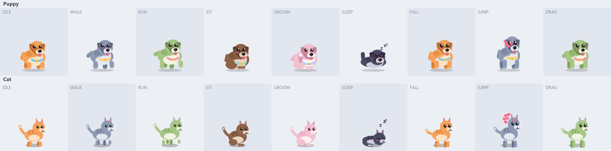

# Desktop Pets

Chubby little puppies that live on your Windows desktop. They wander along the bottom of your
screen, sit, scratch an ear, doze off, and can be picked up and thrown. Built from scratch on
JavaFX — no game engine, no sprite assets, no third-party libraries beyond JavaFX itself.

Puppies are the default. A cat is also included, and you can switch any pet between the two from
its right-click menu.

  



*Every pose of every species, rendered straight out of the code by the preview harness below.*

## Quick start

```powershell
# from the project root
.\run.ps1
```

That builds a fat jar and launches it with `javaw` so no console window sticks around. If you'd
rather do it by hand:

```powershell
mvn clean package
java -jar target\desktop-pets.jar
```

Requires JDK 21+ and Maven. The JavaFX jars are pulled in as normal Maven dependencies with the
`win` classifier and shaded into the output jar, so there's nothing to install separately and no
`--module-path` incantation to remember.

## What you can do with a pet

| Action | Result |
| --- | --- |
| **Left-click** | Pat the pet — hearts, a happy hop, and it wakes up if it was asleep. |
| **Left-drag** | Pick it up. Its paws dangle while you carry it. |
| **Release mid-swing** | Throws it. It arcs, bounces, splats, and kicks up dust on landing. |
| **Right-click** | Menu: add another pet, nap/wake, recall to centre screen, species, size, always-on-top, send this pet home, quit. |

A pet left alone runs its own little life: it strolls, breaks into a sprint, sits down, scratches
behind an ear, and eventually curls up with Zzz's drifting off its head. Each pet gets its own
colour scheme and its own randomly-seeded brain, so a litter of six never moves in lockstep.

Pets roam across **all** your monitors and land on whichever monitor's floor is under them, sitting
on top of the taskbar rather than behind it.

## How it works

The design keeps four concerns strictly separate, which is what makes each piece small enough to
read in one sitting.

**One transparent window per pet.** Each pet owns a 170×170 borderless `Stage` with
`StageStyle.TRANSPARENT` and `setAlwaysOnTop(true)`. The alternative — one full-screen overlay —
would look identical but would swallow every mouse click on your desktop. A small window per pet
means only the ~170 px patch around each pet is click-sensitive, and each pet can independently
float above the taskbar.

**A single simulation loop.** `App` runs one `AnimationTimer` that ticks every `PetWindow` with the
same delta time, rather than giving each pet its own timer. That keeps pets consistent with each
other — two pets thrown identically behave identically — and adding a tenth pet costs a little
drawing rather than a whole extra scheduler. The delta is capped at 1/20 s so that a laptop
resuming from sleep doesn't integrate one enormous step and fling every pet through the floor.

**Behaviour as a weighted state machine.** `Behavior` holds no rendering knowledge at all; it just
picks the next `PetState` when the current one times out, using weights that depend on the current
state. The weighting is what stops the pet from looking like a random-number generator — a sleeping
pet is far more likely to sit up than to instantly sprint, and a walking pet mostly keeps walking.
Physics-imposed states (`FALL`, `DRAG`) are never chosen by the brain; it recognises them and waits
them out.

**Vector rendering, not sprites.** `ChubbyPuppyRenderer` draws the dog from ellipses, rotated ear
ovals, and a stubby stroked tail. This means there are no art assets to license or ship, the pet
stays crisp at any DPI or size, and — most usefully — poses come from *continuous* state rather than
a fixed set of frames. Squash factor, walk phase, blink amount, ear sway, and tail wag are all real
numbers, so a hard landing squashes the puppy more than a gentle one instead of both snapping to the
same "landed" frame.

### Drawing a legible puppy at 60 px

Three things turned out to matter far more than shading, and all three are documented at the top of
`ChubbyPuppyRenderer`:

1. **Mixed perspective.** The body is drawn in profile but the head faces forward. A profile head
   puts the muzzle on the same side as one ear, leaving that ear nowhere to hang but across the
   face; a frontal head lets both ears hang symmetrically off the sides where they are fully visible.
2. **Ears must break the head's outline.** An ear that fits inside the head circle reads as shading,
   or as a dark cap. Both ears are pinned at the skull's extremes and are long enough for the tips to
   hang outside the circle and down to the chin line.
3. **Legs attach inside the torso, not at its lowest point.** An ellipse has no width at its bottom
   vertex, so legs started there hang in mid-air and the paws look detached. They attach at 28% of
   the body height and always run down to the foot anchor.

"Chubby" itself is pure proportion: a torso wider than it is tall, an oversized head, and short thick
legs. Those three ratios are the first things to change if you want a lankier dog.

### Coordinate conventions

Two conventions do a lot of work here and are worth knowing before reading the code:

- **Pets are anchored at their feet.** `Pet.x` is the horizontal centre and `Pet.y` is the ground
  contact point, in virtual-desktop pixels. Anchoring at the feet rather than a corner makes landing
  simply `y == groundY`, and lets squash-and-stretch scale around the anchor without the cat
  appearing to sink into the floor.
- **Drawing happens in pet-local coordinates** where the origin is between the feet, x runs *forward*
  (whichever way the pet faces), and y runs **negative upward**. `BlobCatRenderer.draw` installs the
  transform that maps this onto the canvas, including the facing mirror and the volume-preserving
  squash. Particles are drawn outside that mirror, otherwise the Zzz glyphs would come out backwards.

### Source map

| File | Role |
| --- | --- |
| `Launcher.java` | Non-`Application` entry point — the trick that makes `java -jar` work with JavaFX on the classpath. |
| `App.java` | Spawns pets, owns the frame loop, handles add/remove/quit. |
| `Pet.java` | Mutable per-pet state: position, velocity, facing, state, squash, blink. |
| `PetState.java` | The nine things a pet can be doing. |
| `Behavior.java` | The brain: weighted state transitions, blinking, jump/throw/sleep triggers. |
| `Physics.java` | Gravity, bouncing, friction, ground contact, edge turnaround. |
| `Screens.java` | Multi-monitor geometry — floor height per monitor, roamable desktop bounds. |
| `PetWindow.java` | The transparent stage, drag-and-throw handling, right-click menu. |
| `Particles.java` | Zzz's, hearts, and landing dust. Purely cosmetic; never feeds back into physics. |
| `render/PetRenderer.java` | The drawing seam, so a sprite-sheet renderer could drop in later. |
| `render/ChubbyPuppyRenderer.java` | The procedural puppy (default). |
| `render/BlobCatRenderer.java` | The procedural cat. |
| `Species.java` | Puppy or cat. Appearance only — one enum constant plus one renderer per species. |
| `Palette.java` | Six colour schemes, cycled as pets are added. |
| `Config.java` | Properties file at `~/.desktop-pets/config.properties`. |
| `devtools/RenderPreview.java` | Dev-only: renders every species in every pose to a contact-sheet PNG. |

### Reviewing the art

The pets are otherwise only visible as transparent always-on-top windows, which are awkward to
inspect and impossible to diff. The preview harness renders every species in every pose offscreen so
the art can be reviewed like any other output — look at the sheet, adjust a proportion, regenerate:

```powershell
java -cp target\desktop-pets.jar dev.gauravs.desktoppets.devtools.PreviewMain preview.png
```

## Configuration

Settings persist to `~/.desktop-pets/config.properties` whenever you add, remove, or resize a pet,
and the file is plain text so you can pre-seed a litter before launch:

```properties
pets=3
scale=1.0
palettes=Marmalade,Slate,Matcha
species=PUPPY,PUPPY,CAT
```

`pets` is clamped to 1–12, `scale` to 0.5–2.0. `palettes` and `species` are index-aligned with the
spawn order and may be shorter than `pets`; missing entries cycle the palettes and default to
`PUPPY`. Available palette names: Marmalade, Slate, Matcha, Cocoa, Blossom, Midnight. Species:
`PUPPY`, `CAT`.

## Known limits

These are deliberate scope boundaries, not bugs:

- **Pets don't sit on other windows' title bars.** Shimeji-style ledge-perching needs native window
  enumeration (`EnumWindows` via JNA or the Windows FFM API) to know where the edges are. The floor
  is the taskbar-aware bottom of whichever monitor the pet is over.
- **The window rectangle is click-opaque, not the cat.** Clicking a transparent corner of a pet's
  170 px box still counts as clicking the pet. True per-pixel hit testing would need a native
  layered-window region.
- **No system tray icon.** Adding one means mixing AWT's `SystemTray` into a JavaFX app, which
  brings its own threading caveats. Instead, the last pet can't be sent home, so there's always a
  pet to right-click for the menu.
- **Windows-targeted.** The code itself is platform-neutral; only the `javafx.platform` property in
  `pom.xml` is set to `win`. Change it to `linux` or `mac` to build elsewhere.

## Ideas worth building next

- Native window enumeration so pets can climb and perch on real window edges.
- More species. Each one is a single `PetRenderer` plus a `Species` constant; nothing in the
  simulation needs to know about it.
- A `PetRenderer` backed by PNG sprite sheets, to prove the seam works both ways.
- Pet-to-pet awareness: greeting each other, following, chasing.
- Reacting to your activity — perking up on keystrokes, napping when the machine goes idle.
